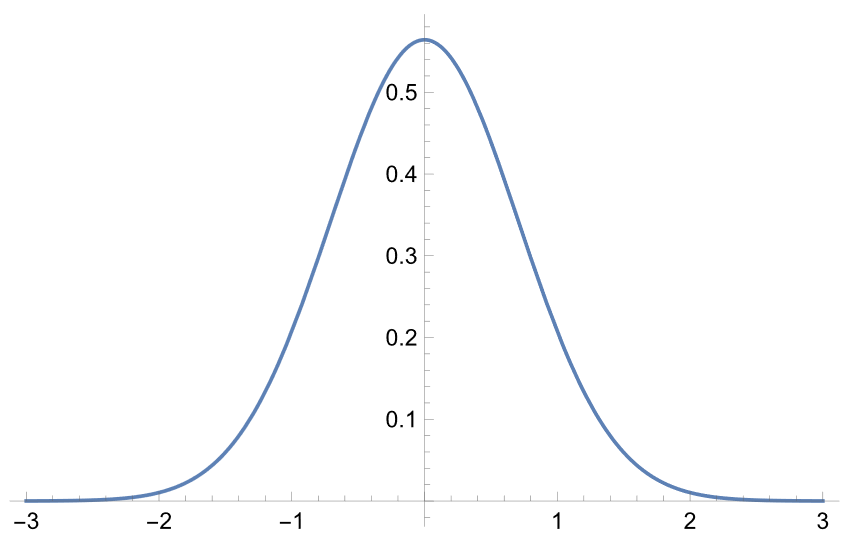
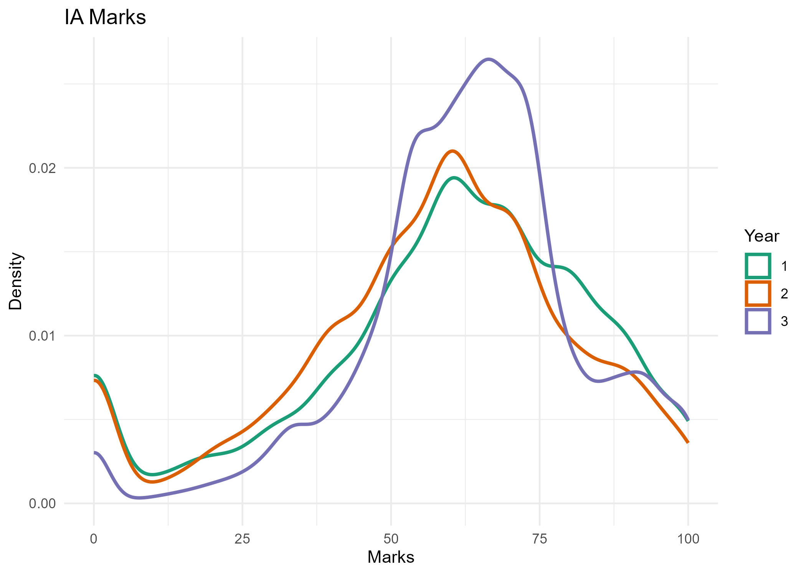

## Introduction

In probability theory, a normal distribution or a Gaussian distribution is a type of continuous probability distribution for a real-valued random variable, such as age, height, marks, and so on. The general form of this distribution is given by

$$f(x)=\frac{1}{\sqrt{2\pi\sigma^2}}e^{-\frac{(x-\mu)^2}{2\sigma^2}}$$

where $\mu$ is the mean or expectation of variable, $\sigma^2$ is the variation, and $x$ is the random variable. When plotted, this looks like a symmetrical bell-shaped curve. For $\mu=1$ and $\sigma^2 = 1/2$, the distribution looks like this:

Here, the peak occurs at mean (in this case, 0), whereas the standard deviation dictates the width of the
curve. While the normal distribution equation written above may appear complex at first glance, it elegantly
describes some of the simplest and most common natural phenomena, such as the distribution of heights
in a population or more complicated events such as measurement errors in scientific experiments.

## Case Study

On campus, one of the most interesting applications of this equation is in modelling of
the distribution of marks in a large class, where scores tend to cluster around the average with fewer
students scoring extremely high or low. This average mostly happens to appear at 60% or around that.
For example, figure 2 represents distribution of marks scored by students of Sri Guru Tegh Bahadur
Khalsa College in internal assessments. The data was taken from college website.

A normal distribution can indeed be seen. In this case, we find that the average lies around 60 as
expected, and marks corresponding to students of all three years follow a similar distribution.

This article is available in PDF format <a href="../../resources/Gaussian_Distribution.pdf" target="_blank">here</a>.

This article is an extract taken from the analysis done on marks and attendance secured by students in Sri Guru Tegh Bahadur Khalsa College, a full version of which can be found <a href="https://github.com/zplus11/MarksAttendance.git" target="_blank">here</a>.