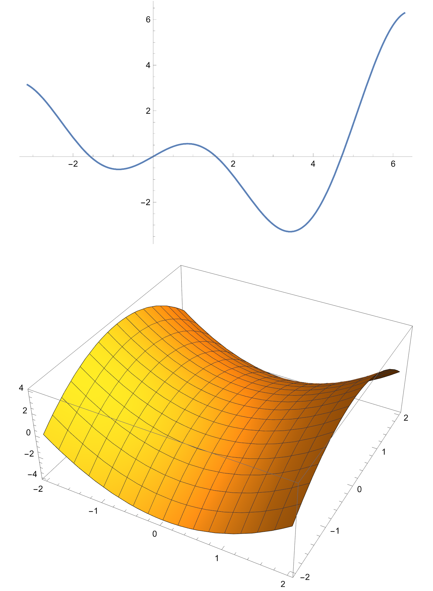
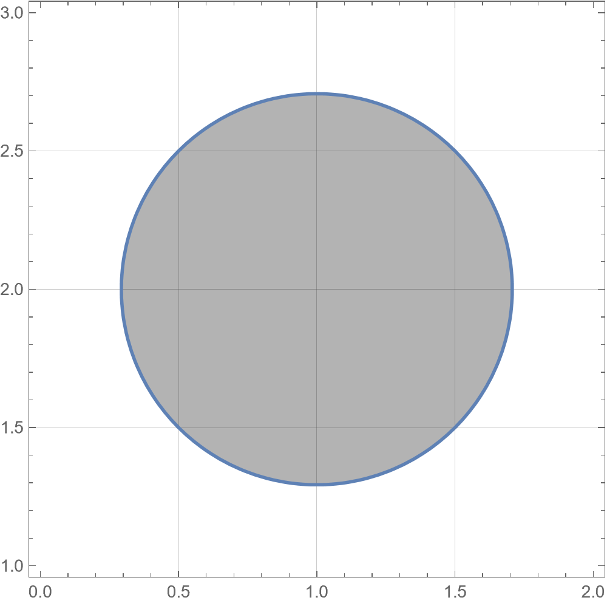
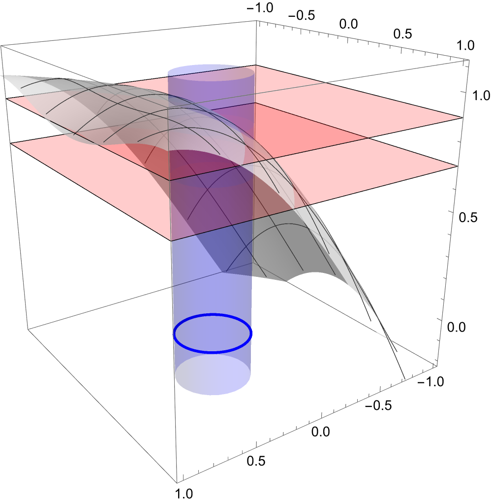
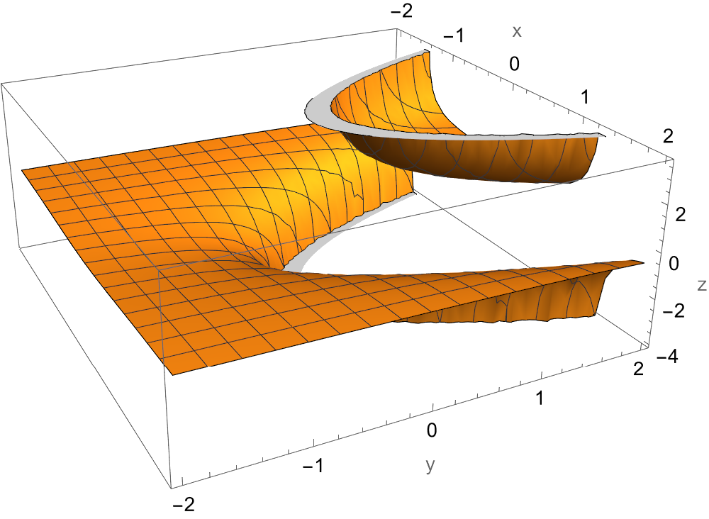

> *If in the first act you hang a gun on the wall, in the next act it must go off.*

--- Anton Chekhov

\def\index#1{}

## Introduction

Calculus\index{calculus} is the study of small changes. Multivariate Calculus\index{multivariate calculus} is the study of changes in functions of multiple variables, such as those defined from $\mathbb R^2$ to $\mathbb R$ by some definition that maps each $(x,y)$ in the domain set to its image given by $f(x,y)$. Every point in the domain (usually a subset of the $xy$-plane\index{$xy$-plane}; figure 1) gets mapped to a real number in $\mathbb R$, along the $z$-axis. Formally, we define the graph of $f(x,y)$\index{$f(x,y)$} to be the collection of all three tuples $(x,y,z)$ such that $(x,y)$ belongs to the domain of $f$ and $z=f(x,y)$. Hence the graph of $f(x,y)$ is a surface in $\mathbb R^3$ whose projection onto the $xy$-plane is the domain $D$.

For example, consider $f(x, y) = 10-x^2-y^2$ for every $(x, y) \in \mathbb R^2$.  Here $(0,0)$ gets mapped to $10-0^2-0^2 = 10$, $(1, 2)$ gets mapped to $10-1^2-2^2 = 5$, and so on.
Along that line, for a constant $c$, the plane $z=c$ intersects the surface $z=f(x,y)$ at $f(x,y)=c$. Such an intersection is called the "trace\index{trace} of graph of $f$" in the plane $z=c$. And further, the level curve\index{Level curve} of $f$ at $c$ is the set of all points $(x,y)$ in the $xy$-plane which satisfy $f(x,y)=c$.

## Open Spheres in $\mathbb R^3$

On the real line, we talked of open intervals of the form $(a,b)$. In two-dimensional calculus, we talked of neighbourhoods (or open disks), which were the collection of all points in $\mathbb R^2$ that were within a certain distance from the point at center. Mathematically, the set
$$\left\{(x,y)\in\mathbb R^2:\sqrt{(x-a)^2 + (y-b)^2}<r\right\}$$
for $r$ being the certain distance and $(a,b)$ being the point at center. If the boundary is to be included, we can replace the strict inequality in favour of including equality.

Furthering this discussion, a point is said to be an interior point of a set $S$ in $\mathbb R^2$ if some open disk\index{open disk} centered at that point is contained entirely in $S$.
If the set $S$ is empty or if each of its points is an interior point, it is said to be open. A point is said to be a boundary point\index{boundary point} of $S$ if every open disk centered at the point contains at least one element that is in $S$ and at least one element that is not in $S$, and in fact, infinitely many such points. $S$ is said to be closed if it includes its boundary, i.e., if it includes all of its boundary points. By convention, the empty set and the universal set of this context --- $\mathbb R^2$ --- are both open as well as closed.

In the same way, we can proceed further onto the next dimension and define open spheres\index{open sphere} in $\mathbb R^3$. Consider a point $P(a,b,c)$, then the open sphere centered at it will be the set
$$
\left\{
\begin{aligned}
(x,y,z) &\in \mathbb{R}^3 :\ 0 < \\
& \hspace{-20pt} \sqrt{(x-a)^2 + (y-b)^2 + (z-c)^2} < r
\end{aligned}
\right\}.
$$
with $r$ being the radius of such sphere. For this sphere again, we can similarly talk of all aspects as done for open disks in $\mathbb R^2$ above. Most properties carry forward with the necessary amendments.

## Limit

For a function of 2 variables, we now define its limit. The mathematical definition is as follows:---

**Definition** *(Limit).*
We say that $\displaystyle\lim_{(x, y)\to(0,0)} f(x,y) = l$ if and only if $\forall\epsilon>0, \exists\delta>0$ such that whenever
$$0< \sqrt{(x-x_0)^2 + (y-y_0)^2} < \delta,$$
we have $|f(x,y) - l|<\epsilon$.

In figure 3, radius of the disk represents $\delta$, and the 2 planes are at a distance of $2\epsilon$ having $l$ at the center. Notice the **geometrical interpretation** of this definition: no matter how much the two parallel planes are to be brought together, there always exists such radius of the disk that of every point of domain within that disk, the image lies between those planes.

Using the definition of limits, for example to prove that $\lim_{(x,y)\to(0,0)} f(x,y) = 0$ where $f(x,y) = (x^2+y^2)^{3/2},$ we can proceed as follows. Let $\epsilon>0$ be given. Then, if 
$$0<\sqrt{x^2+y^2}<\delta,$$ we have
$$|f(x,y)-0| = |(x^2+y^2)^{3/2}| <\epsilon$$
that is if and only if
$$(x^2 + y^2)^{1/2} < \epsilon^{1/3}.$$
Now, set $\delta =\epsilon^{1/3}$, so that we have $|f(x,y)| < \epsilon$ and hence $\lim_{(0,0)} f(x,y)=0$.

Similarly, consider $f(x,y)=y\sin(1/x)$, then
$$\lim_{(x,y)\to(0,0)}f(x,y)=0;$$
proved as follows: let $\epsilon>0$ be given. Then, consider $|f(x,y)-0|$,
$$\begin{aligned}
\left|y\sin\frac1x\right| 
  &= |y|\left|\sin\frac1x\right| \\
  &\le |y| \\
  &= \sqrt{y^2} \\
  &\le \sqrt{x^2 + y^2} \\
  &< \epsilon,\end{aligned}$$
and with $\delta=\epsilon$, we have $|f(x,y)|<\epsilon$, and hence the proof.

For a function $f$ of two variables, when we write $(x,y)\to(x_0, y_0)$, we mean that the point is allowed to approach $(x_0, y_0)$ along any path or axis in $\mathbb R^3$. If limit $f(x,y)$ is not the same for all approaches within the domain of $f$, then it is said that the limit does not exist\index{dne}.

For instance, consider
$$\lim_{(x,y)\to(0,0)} \frac{2xy}{x^2+y^2}.$$
It does not exist. Along $x$ and $y$ axes, the limit is $0$. However, along $y=x$, it is
$$\left.\lim_{(x,y)\to(0,0)}\frac{2xy}{x^2+y^2}\right|_{y = x} = \lim_{y\to0}\frac{y^2}{2y^2} = \frac12.$$
Since limit is not the same along all axes, we conclude that it does not exist.

In case of homogenous equations\index{homogenous equations}, for example in the current question, we can merely set $y=mx$ for $m\in\mathbb R$ and proceed as follows:---
$$\lim_{(x,y)\to(0,0)} f(x,y) = \lim_{x\to0}\frac{x^2m}{x^2 + m^2x^2} = \frac{m^2}{1+m^2}$$
and note that the limit is dependent on $m$, hence also on the path we choose. Therefore, it does not exist.

## Polar Transformations

For functions involving $x^2+y^2$, we may use polar transformations\index{polar transformation} given by
$$x=r\cos\theta, \quad \mathrm{and,}\quad y=r\sin\theta$$
where $x^2=x^2+y^2$, to evaluate the limit which becomes
$$\lim_{r\to0} f(r\cos\theta, r\sin\theta).$$ Polar coordinates usually make the evaluation of such limits extremely easy. Wherever the said term $x^2+y^2$ is spotted, one almost always would want to convert the limit into polar coordinates.

For example, to find
$$\lim_{(x,y)\to(0,0)}\frac{\tan(x^2+y^2)}{x^2+y^2},$$
we may use polar transformations so that the limit becomes
$$\lim_{r\to0}\frac{\tan{r^2}}{r^2}$$
which is $1$. Similarly, for
$$\lim_{(x,y)\to(0,0)} \frac{x^2y^2}{x^2+y^2},$$
we can proceed as follows:---

$$\begin{aligned}
	\lim_{(0,0)} \frac{x^2y^2}{x^2+y^2}
	&\buildrel \mathrm{polar} \over {=}
	\lim_{r\to0}\frac{r^4\cos^2\theta\sin^2\theta}{r^2} \\
	&\ \ =\lim_{r\to0}r^2\cos^2\theta\sin^2\theta \\
	&\ \ =0.
\end{aligned}$$

We end this section with another example. The limit
$$\lim_{(x, y)\to(0, 0)} \frac{x-y}{\sqrt{x^2 + y^2}}$$
can be converted to polar coordinates and evaluated as

$$\begin{aligned}
	\lim_{(x, y)\to(0, 0)} \frac{x-y}{\sqrt{x^2 + y^2}} &\buildrel{\mathrm{polar}}\over {=}\lim_{r\to0}\frac{r(\cos\theta-\sin\theta)}{\sqrt{r^2}} \\
	&\ \; = \cos\theta-\sin\theta
\end{aligned}$$

which depends upon an arbitrary variable $\theta$. This is an indeterminate limit.

## Continuity

We now define continuity for functions of 2 variables. Briefly, a function will be continuous at a point if small changes in the index result in only small changes in the image. Formally, $f(x,y)$ is said to be continuous at $(x_0,y_0)$ if $f(x_0,y_0)$ is defined, if $\displaystyle\lim_{(x, y)\to(x_0,y_0)} f(x,y)$ exists, and if
$$\lim_{(x, y)\to(x_0,y_0)} f(x,y) = f(x_0,y_0).$$
In other words, and mathematically, if $\forall\epsilon>0,\exists\delta>0$ such that whenever $$\sqrt{(x-x_0)^2+(y-y_0)^2} < \delta,$$
we have $|f(x,y) - f(x_0,y_0)|<\epsilon$.

For example, the function
$$f(x,y) = \begin{cases}
	\frac{xy^2}{x^2+y^4}, &(x,y)\not=(0,0), \\
	0, &(x,y)=(0,0),
\end{cases}$$
is not continuous at $(0,0)$.

This is because it fails the very first requirement for continuity --- existence of limit. Along $x=0$, the limit is zero. However, along the path $x=y^2$, the limit comes out to be $1/2$. These limits can be noticed in the plot of this function. Discontinuity can also be visibly seen, as the graph is fairly disturbed at $(0,0)$ (see figure 4).

Consider
$$f(x,y) = \frac{x-y}{x^2+y^2}.$$
Note that both the numerator and denominator are continuous functions of $x,y$, therefore $f$ is continuous for every $(x,y)\neq(0,0)$. At $(0,0)$, $f$ is not defined.

Another interesting example is
$$f(x,y) = \frac{1}{y-x^2}.$$
This is again continuous for all points in the domain except where denominator is zero. That is, along the parabola $y=x^2$.

---

This is the first article on multivariate calculus. If you enjoyed reading it, I am glad. For any feedback or discussion, please contact me via email at namtgr at gmail dot com. The graphs for this article were created using Mathematica. A notebook containing them can be found at [this link](../../resources/mm/fmv.nb).